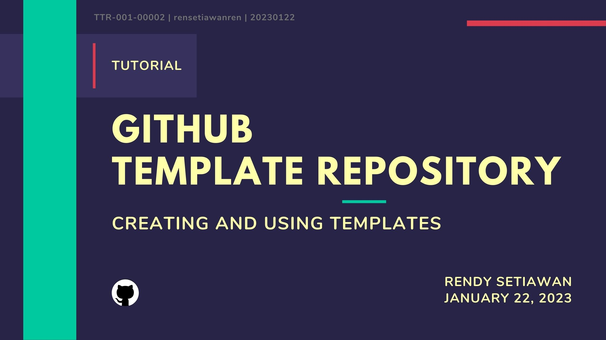

<!--[Banner]-->
<kbd>
  
</kbd>

---

# project-name
Lorem ipsum dolor sit amet, consectetur adipiscing elit, sed do eiusmod tempor incididunt ut labore et dolore magna aliqua.

---

## Table of Content
1. [Project Instruction](#project-instruction)
2. [Project Goals](#project-goals)
3. [Tech Stack](#tech-stack)
4. [Workflow](#workflow)
5. [Task](#task)
6. [Documentation](#documentation)

## Project Instruction
1. Lorem ipsum dolor sit amet, consectetur adipiscing elit, sed do eiusmod tempor incididunt ut labore et dolore magna aliqua.

2. Ut enim ad minim veniam, quis nostrud exercitation ullamco laboris nisi ut aliquip ex ea commodo consequat.

3. Duis aute irure dolor in reprehenderit in voluptate velit esse cillum dolore eu fugiat nulla pariatur.

## Project Goals
- Lorem ipsum dolor sit amet, consectetur adipiscing elit, sed do eiusmod tempor incididunt ut labore et dolore magna aliqua.

- Ut enim ad minim veniam, quis nostrud exercitation ullamco laboris nisi ut aliquip ex ea commodo consequat.

- Duis aute irure dolor in reprehenderit in voluptate velit esse cillum dolore eu fugiat nulla pariatur.

## Tech Stack
##### Programming Language

  <!--[HTML]-->
  
  <!--[Markdown]-->
  

    

##### Versioning Control

    
  <!--[Git]-->
  
  <!--[GitHub]-->
      

    

##### IDE

    
  <!--[Visual Studio Code]-->
  

##### WEB Browser

    
  <!--[Mozilla Firefox Developer Edition]-->
  

#### Operating System

  <!--[MacOS]-->
  

## Workflow
1. Lorem ipsum dolor sit amet, consectetur adipiscing elit, sed do eiusmod tempor incididunt ut labore et dolore magna aliqua.

2. Ut enim ad minim veniam, quis nostrud exercitation ullamco laboris nisi ut aliquip ex ea commodo consequat.

3. Duis aute irure dolor in reprehenderit in voluptate velit esse cillum dolore eu fugiat nulla pariatur.

## Task
Lorem ipsum dolor sit amet, consectetur adipiscing elit, sed do eiusmod tempor incididunt ut labore et dolore magna aliqua.

#### Case 1
1. Lorem ipsum dolor sit amet, consectetur adipiscing elit, sed do eiusmod tempor incididunt ut labore et dolore magna aliqua.

2. Ut enim ad minim veniam, quis nostrud exercitation ullamco laboris nisi ut aliquip ex ea commodo consequat.

3. Duis aute irure dolor in reprehenderit in voluptate velit esse cillum dolore eu fugiat nulla pariatur.

#### Case 2
1. Lorem ipsum dolor sit amet, consectetur adipiscing elit, sed do eiusmod tempor incididunt ut labore et dolore magna aliqua.

2. Ut enim ad minim veniam, quis nostrud exercitation ullamco laboris nisi ut aliquip ex ea commodo consequat.

3. Duis aute irure dolor in reprehenderit in voluptate velit esse cillum dolore eu fugiat nulla pariatur.

#### Mandatory Pages (required)
1. 
2. 
3. 

## Documentation
#### To-Do
- [ ] Complete Workflow
- [ ] Complete Task
- [ ] Create Documentation Report

#### Report
- [Presentation]()
- [Documentation]()

---
